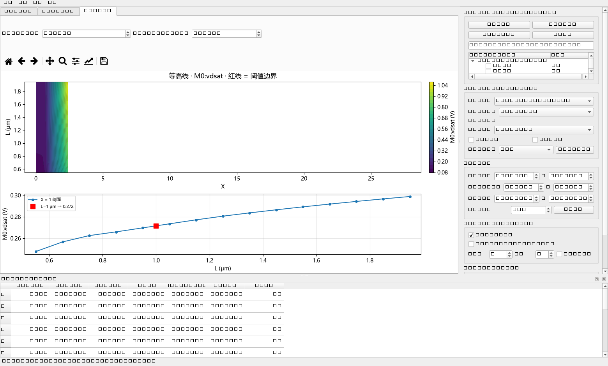

# gm-id-3d-studio · gm/ID 设计数据工作室(全参数浏览 + 三维筛查)

模块化工具:一次导入 **DC 全参数导出文件**(如 `total.csv`,114 个参数 × 15 个 L,
3420 列),全部数据驻留内存但**不显示**;在右侧参数树或独立的
「参数选择窗口」里**实时勾选**要查看的参数,曲线族 / 3D 曲面 / 等高线即时更新。

技术栈: **Python 3.10+ / PySide6 / matplotlib / numpy / scipy** ·
许可证: **MIT**。

## 界面预览

| 曲线族(多参数子图) | 三维曲面 | 剖面与等高线 |
|---|---|---|
|  |  |  |

---

## 开发与 AI 标注

本项目由 [Psi215](https://github.com/Psi215) 与 AI 助手(DeepSeek)**协作开发**:
需求定义、架构方向、测试验证由人类主导;AI 负责代码实现、调试与文档生成。
本仓库中的 AI 生成部分在此统一标注,并以 MIT 许可发布。

> **Acknowledgements:** Co-developed with [DeepSeek](https://www.deepseek.com)
> as an AI-assisted coding tool. Human author: **Psi215**. AI tools are credited
> here rather than as GitHub contributor accounts, since automated systems
> cannot hold repository membership.

## 快速开始

```bat
:: Windows 双击
run.bat

:: 或命令行(示例: 仓库自带样例 / 你自己的 total.csv / 整个文件夹)
python main.py csvdata\selfgain_nch_2.5V.csv
python main.py D:\你的数据\total.csv
python main.py D:\你的数据文件夹
```

* 打开后右侧「① 数据与参数」列出全部参数(文件 → 参数, 支持搜索);
  **勾选即显示**, 勾选多个参数时 2D 视图自动切成多个子图(共享 X 轴);
* **X 轴可选**:「② X 轴参数」下拉框可选择任意参数作 X(按行索引与 Y 配对);
  载入时若数据含 gm/ID 类参数(如 `M0:gmoverid`)会**自动选它作 X**;
  默认"(参数自带 X)"即导出时每个参数自带的扫描变量;
* 「参数选择窗口…」按钮打开**独立选择窗口**, 与主窗口实时联动;
* **数据库管理(⓪)**:把常用文件「导入文件到库…」收进 `library/`
  (复制副本 + 标签), 以后**勾选即加载、取消即卸载**, 不必再翻文件夹;
  关闭程序自动记住上次打开的库文件与视图状态, 下次启动直接恢复;
* **图上测量(⑥)**:「＋ 竖线」添加可拖动竖线(最多任意条, 读出该 x 处各曲线
  取值与两线 Δx);「测斜率(A→B)」点两下取点, 自动吸附到最近数据点并给出
  Δx、Δy、斜率 dy/dx(标记仍可拖动微调);2D 里的红色阈值虚线也能**上下拖动**
  直接改查表阈值;
* **流畅度**:过滤器变化只重算曲面/查表(清洗结果复用)、视图状态无变化时
  跳过重绘、超长曲线显示抽稀、勾选参数不再重建参数树;
* **双击参数名可重命名**(如把 M0:12 改为 `fT (Hz)`),保存在
  `<文件>.meta.json`, 下次打开自动记住;
* 数值显示默认 **原始值(不换算单位)**, 可在「②」切 工程前缀 / dB(仅增益类);
* 3D 曲面 / 剖面等高线 / 反向查表针对「当前指标」(下拉框选择);
* 仓库自带两个小样例:`csvdata/selfgain_nch_2.5V.csv`、`csvdata/ft_nch_2.5V.csv`;
  你自己的完整数据(如 total.csv、pch 等)放在任意目录直接打开即可,
  也可放 `csvdata_extras/`(已被 `.gitignore` 忽略, 不会上传);
* `Ctrl+R` 复位 3D 视角; 「视图」菜单可切深色主题。

## 功能一览

| 功能 | 说明 |
|---|---|
| **自适应解析** | 自动识别 4 类版式: ① 宽表每 L 一对 (X,Y) 列(你现在的文件)② 长表含 L 列 ③ 多指标宽表 ④ 简单两列;分隔符/编码/L 单位(m→µm)自动适配;一个文件可含多个指标、一次可批量导入整个文件夹 |
| **曲线族 2D** | 每条 L 一条线,颜色映射 L;可同时勾选多个数据集(nmos/pmos、不同 VDD、不同工艺角)叠加对比,线型区分数据集 |
| **三维曲面 3D** | 公共 gm/ID 栅格 + 每条 L PCHIP 插值(单调保形、无龙格振荡);可旋转/缩放/读数;多条数据集可叠加;旋转手感可选(转台式/轨迹球/球面/弧球),显示面片自动抽稀保流畅,**「⟲ 视角复位」/ `Ctrl+R` 一键回默认视角** |
| **剖面与等高线** | 等高线 + 固定 gm/ID 的 L 剖面曲线 + 固定 L 处取值标注 |
| **范围过滤联动** | gm/ID、L(µm)、指标上下限同时过滤,所有视图同步刷新;gm/ID 与 L 可选对数轴;指标单位按类型自动适配(增益类另有 dB 视图) |
| **数据清洗** | ① 扫描头部回折剔除(弱反型端 gm/ID 回折,只保留单调主支)② Savitzky-Golay 平滑 ③ MAD 坏点剔除 |
| **反向设计查表** | 按当前指标类型自动适配:增益/fT 默认 **≥ 阈值**(推荐点取可行区最小 gm/ID 保速度);Vdsat/Vgs/电流默认 **≤ 阈值**(推荐点取最大 gm/ID 不浪费裕量);方向可手动切换;阈值单位跟随指标显示单位(dB/GHz/mV/kA·m⁻¹…) |
| **导出** | 当前视图 PNG/SVG/PDF;清洗后长表 CSV;公共栅格曲面 CSV;查表结果 CSV |

## 环境准备与自检

```bat
:: 首次在机器上使用: 创建虚拟环境并安装依赖
python -m venv .venv
.venv\Scripts\pip install -r requirements.txt
.venv\Scripts\python main.py

:: 无 GUI 快速自检(打印解析/清洗/曲面/查表摘要)
.venv\Scripts\python selftest.py [数据文件] [阈值dB]
```

## 使用流程

界面布局:**左侧 = 图形视图(标签页)**,**右侧 = 参数与控制面板**。

1. 「① 数据与参数 → 打开文件…」载入 total.csv 等全参数文件(0.2s 级,
   114 参数全部驻留内存);也可批量载入文件夹/多个文件;
2. 在参数树里搜索并**勾选**要看的参数(默认只显示第一个);勾选多个时
   2D 视图自动切成多个子图;或点「参数选择窗口…」用独立窗口勾选;
3. 双击参数名重命名(如 `M0:12` → `fT (Hz)`),X 轴名在「②」里改,
   自动记住;数值显示默认原始值,可选工程前缀/dB;
4. 「③ 范围过滤」设 X/L/指标范围;「④ 清洗」「⑤ 反向查表」与当前指标联动;
5. 切到「三维曲面 3D」旋转查看(红圈 = 阈值边界, `Ctrl+R` 复位);
6. 下方表格给每个 L 的可行 X 区间与推荐点;菜单「导出」可存图片与各类 CSV。

## 指标类型与单位适配

程序按列头自动识别指标并套用对应“档案”(`gmidlib/metrics.py`),
**不同指标不再共用一套 dB/单位**:

| 指标 | 识别别名示例 | 显示单位 | dB 视图 | 查表默认方向 |
|---|---|---|---|---|
| 自增益 gm·ro | selfgain / gmro / gm_rds / gain / av … | V/V ↔ dB | 支持(列名含 db 自动判“原始即 dB”) | ≥(越大越好) |
| fT / GBW | ft / f_t / gbw / bandwidth / f3db … | Hz→GHz/MHz 自动前缀 | 否(勾选框自动禁用) | ≥ |
| Vdsat / Vgs / Vov | vdsat / vds_sat / vgs / vov / overdrive … | V→mV 自动前缀 | 否 | ≤(上限约束) |
| Inor(归一化电流) | inor / id_nor / id_w / normalized current … | A/m→kA/m 自动前缀 | 否 | ≤ |
| Id | id / ids / current / drain current … | A→µA 自动前缀 | 否 | ≤ |
| Cgg | cgg / cgs / cgd / … | F→pF 自动前缀 | 否 | ≤ |
| 未知指标 | (按原名显示) | 原值无单位 | 否 | ≥/≤ 手动选 |

* 工程前缀按数据量级自动选择(median 落在 1~1000), 只影响显示与筛查,
  内部计算始终用原始值;
* 阈值输入框、指标范围过滤、Y 轴标签、查表结果表的单位全部跟随
  当前数据集的显示单位; 切换数据集时自动换单位并给出合理默认阈值;
* 叠加显示多个不同量纲数据集时, **指标范围过滤只作用于与当前数据集
  同指标名的曲线**, 其它单位的数据集作为参考叠加、不做过滤。

## 数据格式细节

* **全参数宽表**(total.csv 型):列头成对 `参数 (L=数值) X/Y`;解析器按
  `(参数, L)` 分组, 每个参数一个 Metric、每个 L 一条曲线; 表头里没有
  参数名的文件按 `M0:N` 显示, 双击重命名(存 `<文件>.meta.json`);
* 旧版每指标宽表(selfgain_nch_2.5V.csv 型)、长表、简单两列同样兼容;
* 各 L 的 X 栅格不必一致 —— 画面前自动 PCHIP 插值到公共栅格,
  超出某条 L 实测范围处曲面留空(不外推假数据);
* L 单位自动判断(m/µm/nm 均可, 内部统一为 µm 显示);
* 数值**原始值不动**, 显示模式(原始/前缀/dB)只影响视图与筛查。

## 目录

```
gmid_tool/
  main.py             入口(全参数工作室)
  gmstudio/           模块化核心
    app.py            应用入口
    core/
      model.py        Source/Metric/Curve 数据模型
      loader.py       全参数宽表/旧宽表/长表装载(全部驻留内存)
      session.py      会话状态: 勾选/过滤/清洗/曲面/查表/重命名持久化
    ui/
      theme.py        浅色/深色 QSS 主题
      widgets.py      matplotlib 画布 + 持久色标
      param_browser.py 参数树 + 独立选择窗口
      viewer.py       主窗口(2D 子图族 / 3D / 等高线 / 查表 / 导出)
  gmidlib/            底层算法库(解析/清洗/曲面/查表/指标档案)
  gui.py              旧版单窗口 GUI(兼容保留)
  selftest.py         无 GUI 管线自检
  requirements.txt    依赖清单
  run.bat             Windows 双击启动
```

> 提示: 直接双击 `run.bat` 或按上方命令启动即可; 图上中文用
> Microsoft YaHei 渲染。
