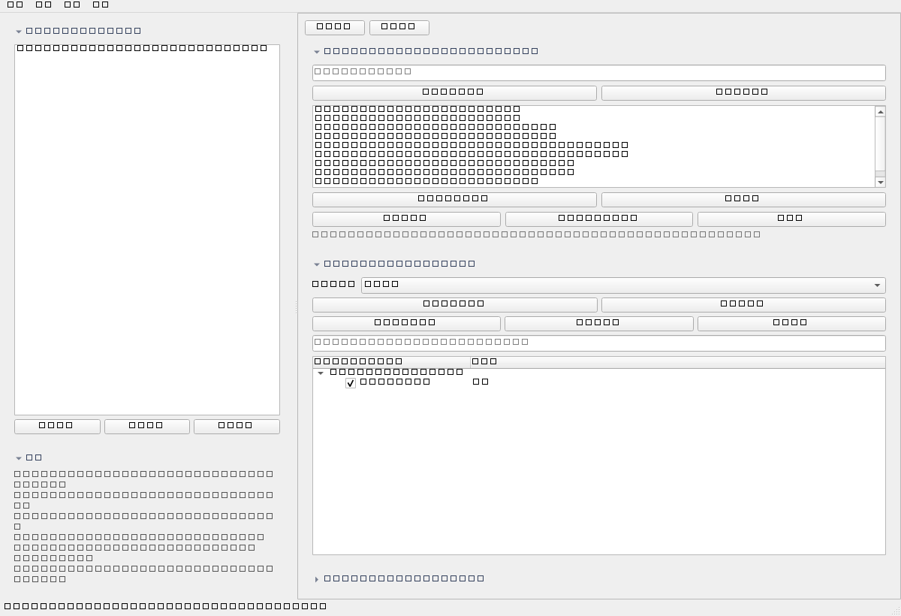
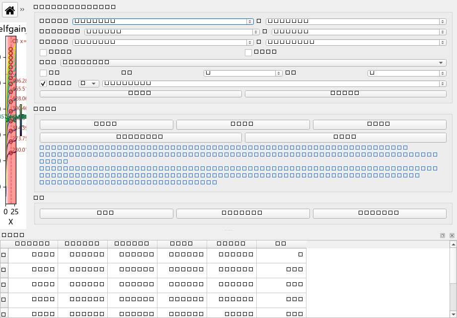
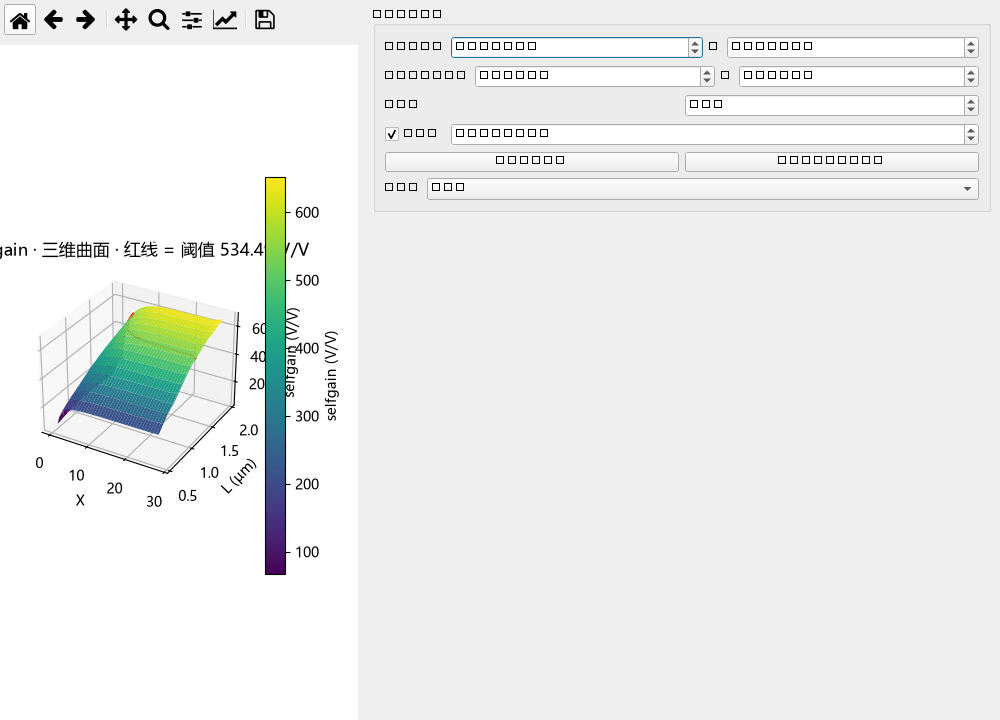

# gm-id-3d-studio · gm/ID 设计数据工作室

面向模拟 IC 设计者的 **gm/ID 数据浏览器**:一次导入 DC 全参数导出文件
(例如 114 个参数 × 15 个 L、3420 列的宽表),数据全部驻留内存但**不画任何图**;
在**控制台**里管理数据与参数,每个参数在自己的**独立窗口**中绘制,
三维曲面从某个二维窗口**按需进入**。

技术栈:**Python 3.10+ · PySide6 · matplotlib · numpy · scipy** ·
许可证:**MIT**。

## 架构一览

```
┌──────────────── 控制台 MainWindow ────────────────┐
│ ⓪ 数据库        双击条目 = 加载 / 再双击 = 卸载     │
│ ① 参数          显示文件过滤 + 双击参数 = 打开窗口   │
│ ② 新窗口默认约束 只作为新开窗口的初值               │
│ 打开的窗口列表   全部置前 / 关闭 / 重绘             │
└───────────┬───────────────────────────────────────┘
            │ 双击参数
            ▼
   ┌── 2D 窗口(每参数一个, 约束互相独立)──┐   ┌─ 3D 窗口(按需)─┐
   │ 范围 / 对数轴 / 平滑 / 显示单位 / 查表 │──▶│ 三维曲面 + 阈值线│
   │ ＋竖线 ＋横线(交点读数) 测斜率(A→B)   │   │ 旋转 LOD · 复位  │
   └───────────────────────────────────────┘   └────────────────┘
```

## 界面预览

| 控制台 | 2D 绘图窗口 | 三维曲面窗口(按需打开) |
|---|---|---|
|  |  |  |

## 核心特性

| 特性 | 说明 |
|---|---|
| **自适应解析** | 自动识别 4 类版式:① 宽表(每 L 一对 X/Y 列)② 长表(含 L 列)③ 多指标宽表 ④ 简单两列;分隔符/编码/L 单位(m→µm)自适应 |
| **数据全驻留、按需绘制** | 载入只解析与索引,不画图;双击参数才开窗,几百个参数也不卡 |
| **每窗口独立约束** | 范围(X/L/指标)、X·L 对数轴、平滑、显示单位、查表阈值/方向都在各自窗口里,互不影响 |
| **3D 按需进入** | 控制台不常驻 3D;在任意 2D 窗口点「三维曲面…」弹出独立 3D 窗口,旋转时自动降级面片保证流畅 |
| **图上测量** | ＋竖线/＋横线可直接拖动,实时给出与**每条曲线的交点值**(带 L 标签与图上标注);「测斜率(A→B)」取两点算 Δx/Δy/斜率;红色阈值虚线可拖动改阈值 |
| **反向设计查表** | 按指标类型自动选方向:增益/fT **≥**、Vdsat/Vgs/电流 **≤**;输出每个 L 的可行区间与推荐工作点 |
| **数据库管理** | 常用文件入库(复制副本 + 标签),双击即加载/卸载,不必每次翻文件夹;启动只恢复数据与默认约束 |
| **指标单位适配** | 每个指标识别类型并**固定一个工程前缀**(Hz→GHz、A→µA、V→mV…),曲线/曲面/过滤/查表/标签共用同一刻度 |
| **导出** | 窗口内导出图片(PNG/SVG/PDF)、曲线数据 CSV、查表结果 CSV |
| **流畅度** | 分级缓存(改范围只重算曲面)、视图指纹一致则跳过重绘、超长曲线抽稀、参数树只同步状态不重建 |
| **细节** | 滚轮悬停不误改数值(可关);深色/浅色主题;参数可重命名并持久化 |

## 快速开始

```bat
:: Windows: 双击 run.bat(优先用仓库内 .venv, 其次上层工作区 .venv, 最后系统 python)

:: 或命令行
python main.py                      :: 空控制台
python main.py csvdata\selfgain_nch_2.5V.csv
python main.py D:\你的数据文件夹
```

首次在新机器上:

```bat
python -m venv .venv
.venv\Scripts\pip install -r requirements.txt
.venv\Scripts\python main.py

:: 无 GUI 自检(解析/清洗/曲面/查表摘要)
.venv\Scripts\python selftest.py [数据文件] [阈值dB]

:: 单元测试
.venv\Scripts\python -m unittest discover -v
```

## 使用流程

1. **载入数据**:「⓪ 数据库」里**双击条目**(或先把文件夹导入库);也可用「打开文件…」临时打开。
   *载入只出现在参数树里,不会自动弹图。*
2. **打开图像**:在「① 参数」里搜索/过滤(可选「显示文件」只看某一个文件),**双击参数**即弹出该参数的 2D 窗口;勾选参数同样会打开窗口,取消勾选会关闭它。
3. **窗口内操作**:
   - 约束:范围、X/L 对数轴、平滑(Savgol 窗/阶)、显示单位(原始 / 工程前缀 / dB)、查表开关+方向+阈值;
   - 测量:「＋竖线」「＋横线」拖动读交点值(面板给全、图上标注部分),「测斜率(A→B)」两下取点;
   - 查表:红色竖条 = 可行区,底部表格给每 L 的推荐工作点;
   - 导出:图片 / 数据 CSV / 查表 CSV。
4. **进入三维**:**在 2D 窗口里**点「三维曲面…」→ 独立 3D 窗口(默认继承该窗口约束,可单独调整、也可「与 2D 窗口同步」);旋转手感可选,`⟲ 复位视角`。
5. **重命名**:控制台「重命名选中」可把 `M0:12` 改成 `fT (Hz)` 之类,保存在 `<文件>.meta.json`,并自动按新名字重新识别指标档案(单位与查表方向)。

## 指标类型与单位适配

`gmidlib/metrics.py` 内置指标档案,按列头自动识别(支持 `M0:vdsat` 这类带器件前缀的名字,
也容忍 `vdast` 等常见拼写错误):

| 指标 | 识别别名示例 | 显示单位 | dB 视图 | 查表默认方向 |
|---|---|---|---|---|
| 自增益 gm·ro | selfgain / gmro / gm/gds / gain / av … | V/V ↔ dB | 支持(列名含 db 自动判“原始即 dB”) | ≥ |
| fT / GBW | ft / f_t / gbw / bandwidth / f3db … | Hz→GHz/MHz | 否 | ≥ |
| Vdsat / Vgs / Vov | vdsat / vdast / vds_sat / vgs / vov … | V→mV | 否 | ≤ |
| Inor(归一化电流) | inor / id_nor / id/w / normalized current … | A/m→kA/m | 否 | ≤ |
| Id | id / ids / current … | A→µA | 否 | ≤ |
| Cgg | cgg / cgs / cgd … | F→pF | 否 | ≤ |
| 未知指标 | (按原名显示) | 原值、无单位 | 否 | ≥/≤ 手动选 |

* 每个指标的前缀只算一次并缓存(键 = 源文件路径 + 参数名 + 单位),因此同一指标在
  曲线、曲面、过滤、查表、轴标签里**用同一个刻度**;
* 数值**原始值不动**,显示模式只影响视图与筛查。

## 数据格式细节

* **全参数宽表**:列头成对 `参数 (L=数值) X/Y`;解析器按 `(参数, L)` 分组,
  每个参数一个 Metric、每个 L 一条曲线;没有参数名的文件按 `M0:N` 显示;
* 旧版每指标宽表、长表、简单两列同样兼容;
* 各 L 的 X 栅格不必一致 —— 画面前自动 PCHIP 插值到公共栅格,超出实测范围处留空(不外推);
* 支持**换 X 轴**:在窗口里选择任意参数作 X(按行索引配对),默认自动选 gm/ID 类参数;
* L 单位自动判断(m/µm/nm 均可,内部统一为 µm)。

## 目录

```
gmid_tool/
  main.py                 入口(控制台)
  run.bat                 Windows 双击启动(三级解释器回退)
  gmstudio/
    app.py                应用入口
    core/
      model.py            Source / Metric / Curve 数据模型(含 source_path 唯一标识)
      loader.py           宽表/长表/两列装载(全部驻留内存)
      session.py          会话与视图状态 ViewState: 范围/显示/查表/曲面/缓存
      library.py          数据库: 入库、标签、会话记忆
    ui/
      theme.py            浅色 / 深色 QSS 主题
      widgets.py          matplotlib 画布 + 持久色标 + 可折叠区块 + 滚轮防误触
      interact.py         图上交互: 竖线/横线交点读数、两点测斜率、阈值拖动
      param_browser.py    参数树(文件过滤/重命名) + 参数选择窗口
      plot_window.py      2D 绘图窗口 + 3D 曲面窗口
      viewer.py           控制台主窗口
      library_panel.py    数据库面板(双击加载/卸载)
  gmidlib/                底层算法库(解析/清洗/曲面/查表/指标档案)
  gui.py                  旧版单窗口 GUI(历史保留)
  tests/                  unittest(main:`python -m unittest discover`)
  dev/                    开发回归脚本(离屏 GUI 测试、压测、截图)
  docs/screenshots/       界面截图
  csvdata/                两个小样例数据
  library/                数据库目录(不入库, 由 .gitignore 忽略)
```

## 测试

```bat
python -m unittest discover -v      :: 8 项: 单位刻度一致性、同名文件隔离、视图独立、启动脚本
python dev\_features_check.py       :: 窗口化架构: 独立约束 / 3D 按需 / 游标交点 / 库 / 刷新跳过
python dev\_repro_uncheck.py        :: 反复开窗关窗压测
python dev\_wheel_check.py          :: 滚轮防误触
python dev\_torture.py              :: 旧版 GUI 回归
```

## 致谢

* **[Binah-Dev](https://github.com/Binah-Dev)** —— PR
  [#1](https://github.com/Psi215/gm-id-3d-studio/pull/1)
  「Fix metric scaling, lookup state, source identity, and launcher」:
  单位刻度一致性、同名源文件隔离、查表方向同步、启动脚本 `run.bat` 修正。
  该 PR 已合入当前架构(并在 `tests/` 中补上了对应的回归用例)。
* 开发过程由 [Psi215](https://github.com/Psi215) 与 AI 助手(DeepSeek)协作完成:
  需求定义、架构方向与测试验证由人类主导,AI 负责代码实现、调试与文档生成;
  AI 生成部分在此统一标注,按 MIT 许可发布。

## 许可证

MIT License,见 [LICENSE](LICENSE)。
